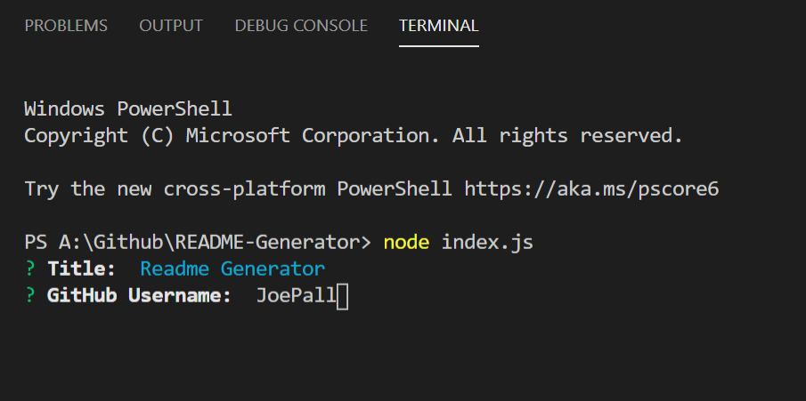
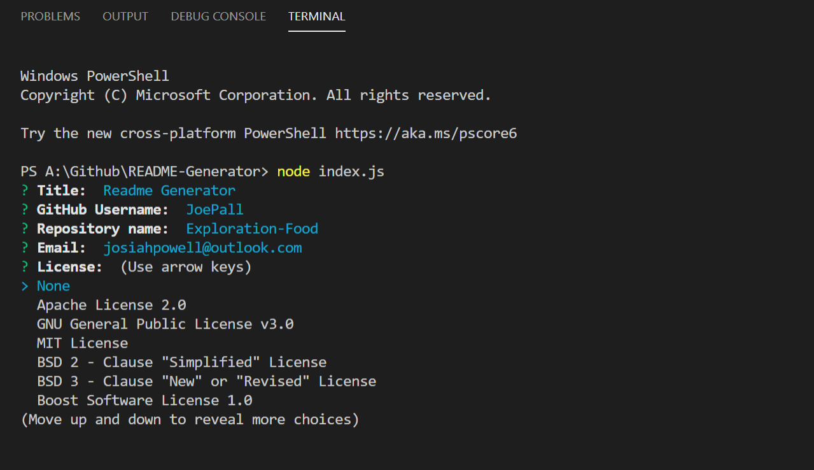

# readme 2020

## Description

This is a CLI app for generating readme.md files.

## Questions

Contact me at <a href="mailto:josiah.a.powell@gmail.com">josiah.a.powell@gmail.com</a> or checkout my GitHub Profile at <a href="https://github.com/JoePall">JoePall</a>.

## License

Apache License 2.0

